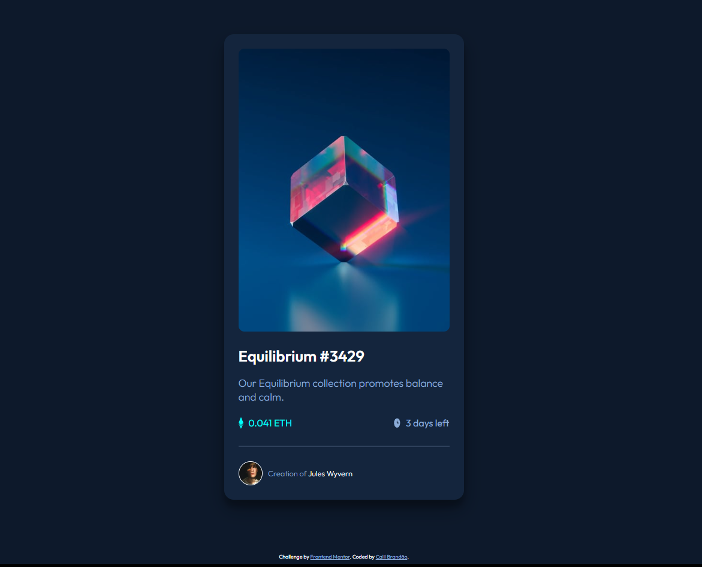

# Frontend Mentor - NFT preview card component solution

This is a solution to the [NFT preview card component challenge on Frontend Mentor](https://www.frontendmentor.io/challenges/nft-preview-card-component-SbdUL_w0U). Frontend Mentor challenges help you improve your coding skills by building realistic projects. 

## Table of contents

- [Overview](#overview)
  - [The challenge](#the-challenge)
  - [Screenshot](#screenshot)
  - [Links](#links)
- [My process](#my-process)
  - [Built with](#built-with)
  - [What I learned](#what-i-learned)
- [Author](#author)

## Overview

### The challenge

Users should be able to:

- View the optimal layout depending on their device's screen size
- See hover states for interactive elements

### Screenshot




### Links

- Solution URL: [Add solution URL here](https://your-solution-url.com)
- Live Site URL: [Add live site URL here](https://your-live-site-url.com)

## My process

### Built with

- Semantic HTML5 markup
- CSS custom properties
- Flexbox
- CSS Grid


### What I learned

In this challenge I managed to understand how the interactive elements work using hover in the css, I also managed to implement some shadows in the layout of the information box, which makes a good impression at first glance

```css
.card {
box-shadow: rgba(0, 0, 0, 0.3) 0px 19px 38px, rgba(0, 0, 0, 0.22) 0px 15px 12px;
}
```
```css
.overlay:hover {
    background-color: hsl(178, 100%, 50%) ;
    opacity: 0.7;
    transition: all 0.3s ease-in-out;
}
```


## Author

- Github - [@CbrandsDev](https://github.com/CBrandsDev)
- Frontend Mentor - [@CBrandsDev](https://www.frontendmentor.io/profile/CBrandsDev)
- Twitter - [@onlythecalil](https://twitter.com/onlythecalil)

